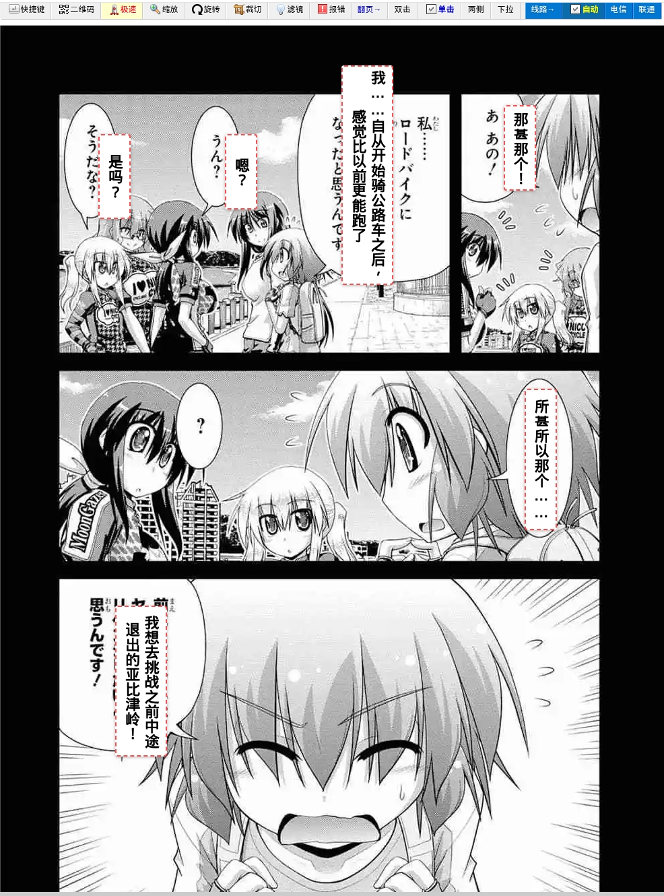
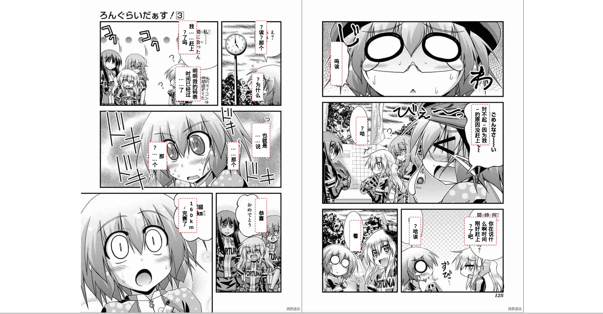
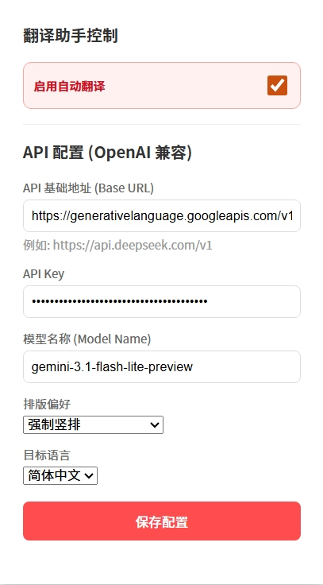

# 智能漫画翻译助手 (MangaTrans)

一个基于多模态大模型（OpenAI 兼容接口）的 Chrome 浏览器扩展，实现网页漫画的即时识别、翻译与嵌入式渲染。

[**点击前往 Chrome 应用商店安装**](https://chromewebstore.google.com/detail/%E6%99%BA%E8%83%BD%E6%BC%AB%E7%94%BB%E7%BF%BB%E8%AF%91%E5%8A%A9%E6%89%8B-mangatrans/leakjfklokioebbhlbdkllojkohblahn)

## 适配网站(不配合ComicRead.js脚本时)

- [x] **[漫画柜 (看漫画)](https://www.manhuagui.com/)**

## 核心特性

- **🚀 深度适配 ComicRead 脚本**：兼容 [ComicRead](https://greasyfork.org/zh-CN/scripts/374903-comicread) 增强脚本，支持在阅读模式、卷轴模式下自动穿透 Shadow DOM 进行翻译。
- **🤖 智能 OCR 与翻译**：调用多模态大模型，自动翻译和嵌字。
- **📏 自适应渲染**：
  - **动态字号**：根据气泡大小自动计算最佳字体，解决文本 underfill 或溢出问题。
  - **竖排支持**：智能检测日系漫画的竖排气泡，并应用 `vertical-rl` 排版。
  - **视觉增强**：采用半透明白底黑字配合彩色虚线边框，既能遮盖原句，又能清晰辨识。
- **⏱️ 智能生命周期管理**：
  - **刷新自动重置**：识别页面 F5 重载并自动关闭翻译，节省 API 消耗。
- **🔍 智能过滤**：
  - 自动忽略页码、标题、作者名及水印。
  - 自动滤除仅包含标点符号（如 `?` `!` `...`）的无效气泡。
- **📚 术语一致性**：自动提取并记忆人名、地名等专有名词，确保全篇翻译风格统一。

## 安装与配置

### 1. 手动加载扩展
1. 下载本项目代码到本地。
2. 打开 Chrome 浏览器，访问 `chrome://extensions/`。
3. 开启右上角的 **“开发者模式”**。
4. 点击 **“加载已解压的扩展程序”**，选择 `manga-trans-extension` 目录。

### 2. 配置 API
点击扩展图标打开弹出面板：

- **Base URL**: 填入 OpenAI 兼容的 API 地址（如 `https://generativelanguage.googleapis.com/v1beta/openai/` 或各类中转地址）。
- **API Key**: 您的模型密钥。
- **Model Name**:如 `gemini-3.1-flash-lite-preview`。
- **目标语言**: 支持中、英、日、韩、俄等多种语言。

## Token 开销

由于本插件使用多模态大模型进行图像识别与翻译：
- **每页漫画开销**: 大约消耗 **2000 Tokens**（含图片输入与文本输出）。

## 免责声明

本插件仅供学习与技术交流使用，严禁用于任何商业用途。请支持正版漫画。

## 开源协议

本项目采用 [GPL-3.0](LICENSE) 协议开源。

---
Created by [entr0pia](https://github.com/entr0pia)
